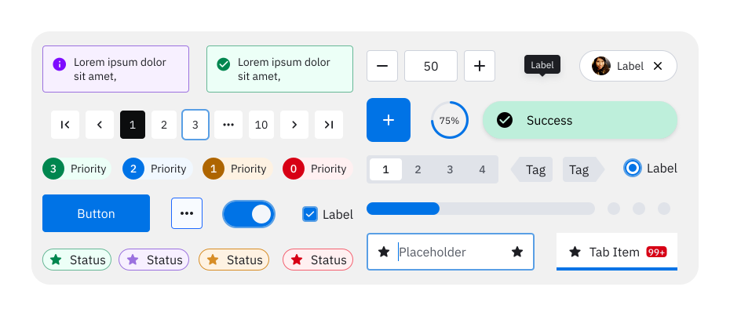

<h1 class='sbdocs-title'>@zebra-fed/zeta-web</h1>

<picture>
  <source media="(prefers-color-scheme: dark)" srcset="./documentation/dark-wide.svg">
  <source media="(prefers-color-scheme: light)" srcset="./documentation/light-wide.svg">
  
</picture>

Zeta Web is a native web component library created by Zebra Technologies written in TypeScript.  
The Zeta Design System includes foundations, components, and best practices that can be used when building UX.

## Previewing the components

To view examples of all the components in the library, you can pull this repo and run the Storybook instance.

You can also view the latest release at [Zeta](https://design.zebra.com/) or the latest commits to main [here](https://zeta-web-main.web.app/).

## Quick Start: New React Project

Starting a brand-new project? Scaffold a Vite + React 19 + TypeScript app pre-wired with Zeta Web in one command:

  ```bash
  npx zeta-web init-react my-app
  ```

  or

  ```bash
  npx zeta-web init-react my-app --pm=yarn --linter=eslint
  ```

You'll be asked three questions - project name , package manager (npm/yarn), and linter (eslint/oxlint) - (skipped if passed as an arguments, as above). Everything else runs automatically:

- Scaffolds the Vite + React + TypeScript project
- Installs dependencies, including `@zebra-fed/zeta-web` and `@zebra-fed/zeta-icons`
- Wires the Zeta global styles into `main.tsx`
- Replaces the default Vite boilerplate with a working example component styled using Zeta design tokens
- Adds the `use-zeta-react` and `discover-zeta-react` Claude Code skills to `.claude/skills`
- Configures the [CSS Variable Autocomplete](#css-variable-autocomplete) VSCode extension for Zeta's tokens
- Verifies the project builds

At the end, you'll be asked if you want to start the dev server right away.

Already have a project? See [How to Use](#how-to-use) below to add Zeta Web manually.

## How to Use

Zeta Web Components can be directly used in many web frameworks including Angular and React (from v19).

1. Install `@zebra-fed/zeta-web`

   ```sh
   # NPM
   npm install @zebra-fed/zeta-web
   # YARN
   yarn add @zebra-fed/zeta-web
   ```

2. Import the global styles into the main app file

   ```js
   import "@zebra-fed/zeta-web/index.css";
   ```

   or in HTML,

   ```html
   <link rel="stylesheet" href="./node_modules/@zebra-fed/zeta-web/dist/style.css" />
   ```

3. Import the desired Zeta Web Component, or the full package into your app:

   ```js
   // Individual button component
   import "@zebra-fed/zeta-web/dist/components/button/button.js";

   // or full package
   import "@zebra-fed/zeta-web";
   ```

   or in HTML,

   ```html
   <!-- Individual button component -->
   <script type="module" src="./node_modules/@zebra-fed/zeta-web/dist/components/button/button.js"></script>

   <!-- or full package-->
   <script type="module" src="./node_modules/@zebra-fed/zeta-web/"></script>
   ```

   To reduce bloat, we recommend only importing the components you will actually use into your project.

4. Use the Web Component like any HTML element

   ```html
   <zeta-button>Hello world!</zeta-button>
   ```

### Claude Code Skills

After installing, you can set up Claude Code skills that teach AI agents how to use Zeta Web components in your project. To copy Zeta Web's Claude Code skills into your project, run:

```bash
npx zeta-web init-skills
```

This command will copy skills like `use-zeta-react` into your project's `.claude/skills/` directory. These skills provide AI agents with specific guidance on using Zeta Web components in your application.

If you can't see the skills, ensure you run `/reload-skills` in Claude Code. 

### Styles

Zeta styles are composed of primitives (basic value swatches such as `color-red-10`, `spacing-4`) and semantic tokens (descriptive values like `surface-default`, `spacing-large`, `avatar-purple`). These are imported via `index.css`.

To learn more about Zeta theme, see [tokens](https://design.zebra.com/docs/Theme/tokens).

If you only need the styles, simply import `index.css`. Importing `index.css` is not necessary if you are using the Zeta components, as they include the styles automatically.

By default, if the user has set `prefers-color-scheme` or `prefers-contrast`, this will be respected - serving light or dark; regular or high contrast tokens.

To override a theme, you can add `data-theme: light | dark` or `data-contrast: less | more` attributes to any element. This will cause any child element to respect that value.

> Note: If you want to apply `data-theme` or `data-contrast` within the shadow dom, you will need to inject the styles again.

```ts How to inject Zeta index.css in a new custom lit element.
// Importing styles into Lit
import * as zeta from "@zebra-fed/zeta-web/index.css?raw";
import { html, LitElement } from "lit";

@customElement("a")
export class A extends LitElement {
  static styles = [unsafeCSS(zeta.default)];

  // (Optionally) apply the data-* attribute to the whole element.
  @property({ attribute: "data-theme", reflect: true }) theme = "dark";
  @property({ attribute: "data-contrast", reflect: true }) contrast = "more";

  protected override render() {
    return html`<div data-theme="dark" data-contrast="more">
      // Or you can apply the data-* attributes to individual children
    </div>`;
  }
}
```

### React

From React 19 web-components work natively. `zeta-web` can be imported into your React project and used directly in JSX.

#### TypeScript and "JSX.IntrinsicElements" errors.

As of v0.5.3 this issue should no longer occur.

If you find TypeScript complains that `Property 'zeta-*' does not exist on type 'JSX.IntrinsicElements'`, you need to add the declared zeta components into React's JSX.IntrinsicElements namespace. To do this:

```ts
import { CustomElements } from "@zebra-fed/zeta-web/jsx.d.ts";

declare module "react" {
  namespace JSX {
    interface IntrinsicElements extends CustomElements {}
  }
}
```

## Developer Experience

To improve the development experience while using the zeta web-components, the following packages can be useful:

### [`ts-lit-plugin`](https://www.npmjs.com/package/ts-lit-plugin)

ts-lit-plugin adds type checking and code completion to lit-html. To install, first setup typescript in your project, then run:

```bash
# NPM
npm install ts-lit-plugin -D

# Yarn
yarn add -D ts-lit-plugin
```

and add the plugin to your tsconfig.json:

```json
{
  "compilerOptions": {
    "plugins": [
      {
        "name": "ts-lit-plugin"
      }
    ]
  }
}
```

### [CSS Variable Autocomplete](https://marketplace.visualstudio.com/items?itemName=vunguyentuan.vscode-css-variables)

This extension makes working with CSS variables easier by showing the values of variables when you hover over them and displaying colors inline in the IDE.
To use this, install it in VSCode, and add the following into .vscode/settings.json:

```json
{
  ...
  "cssVariables.lookupFiles": [
    "node_modules/@zebra-fed/zeta-web/primitives.css",
    "node_modules/@zebra-fed/zeta-web/semantics.css",
    // Add other css files here
  ]
}
```

This configuration will show light mode / regular contrast tokens on hover.

> **Note:** The primitives.css file and semantics.css files should **not** be used in your app as these only contain a subset of the styles; rather import **index.css**, as this contains all rules.

## Licensing

This software is licensed with the MIT license (see [LICENSE](./LICENSE) and [THIRD PARTY LICENSES](./LICENSE-3RD-PARTY)).
